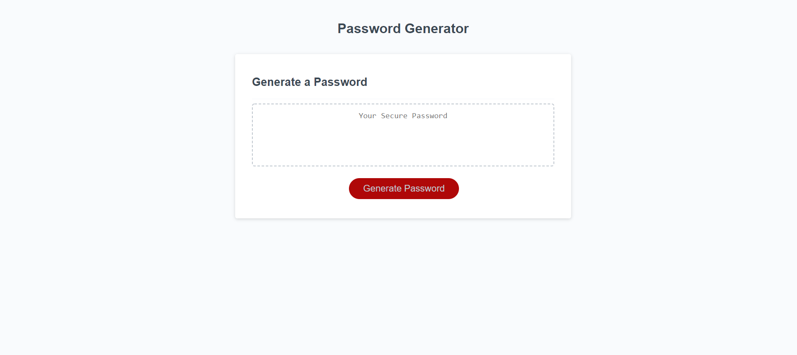
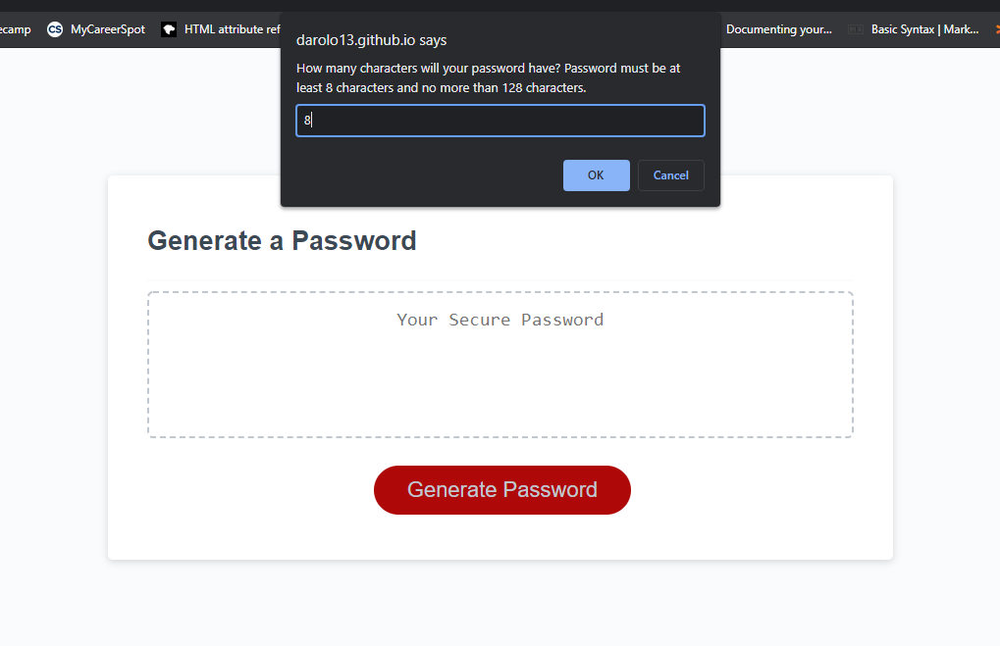
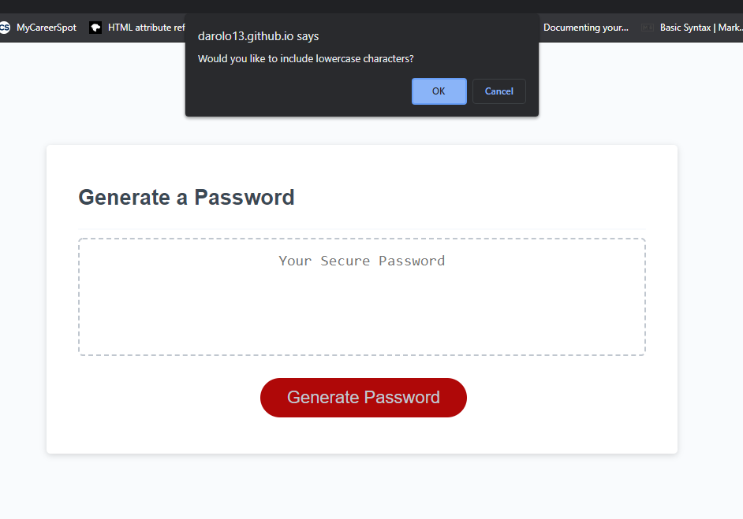
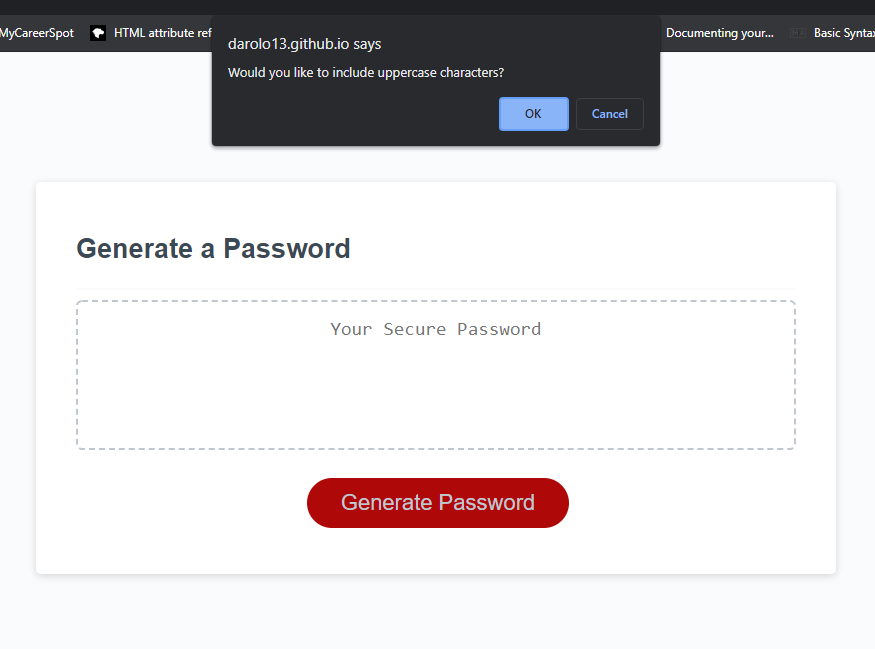
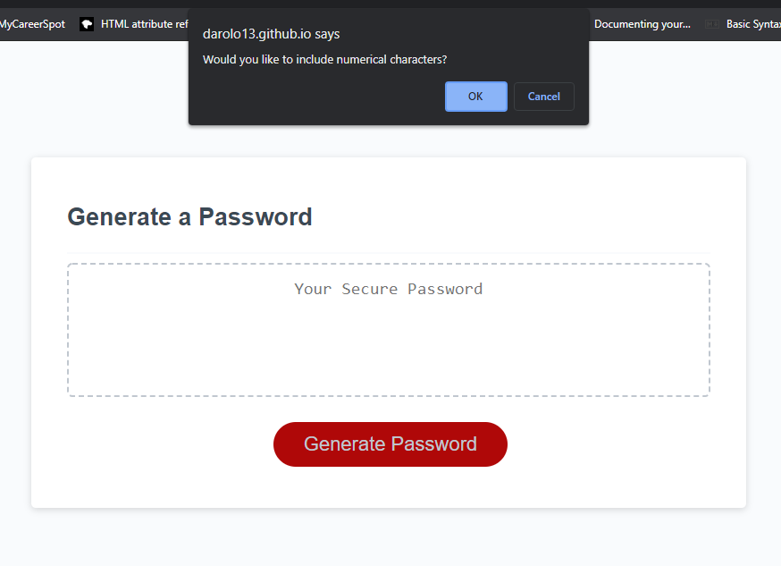
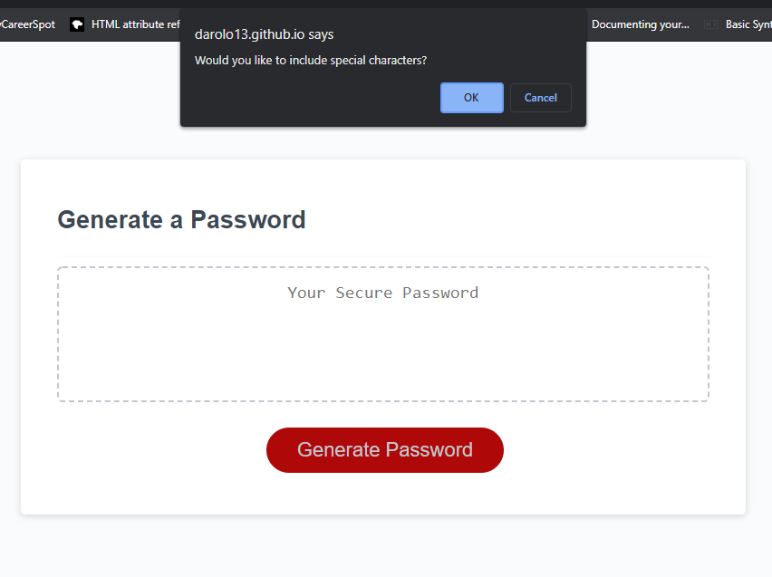
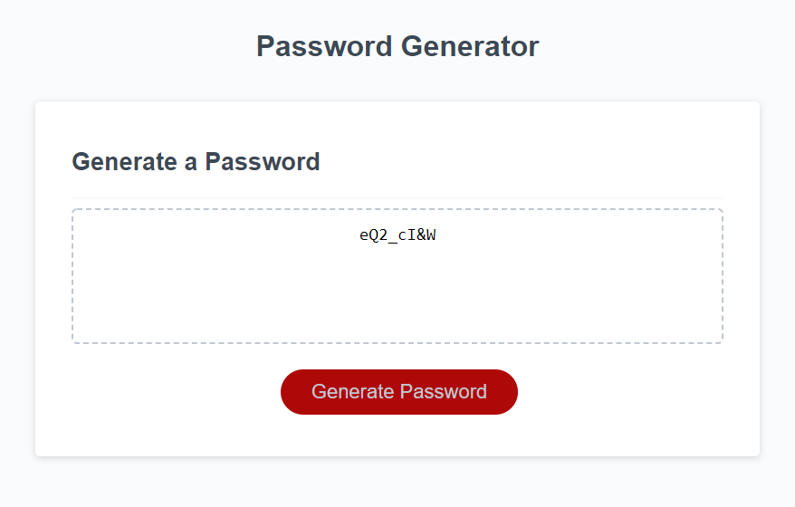

# Password Generator
> Password generator where the user can select the length and type of characters with prompts making the process fast and simple.
> Live demo [_here_](https://darolo13.github.io/password-generator). 

## Table of Contents
* [Technologies Used](#technologies-used)
* [Features](#features)
* [Screenshots](#screenshots)
* [Project Status](#project-status)
* [Room for Improvement](#room-for-improvement)

## Technologies Used
- Tech 1 - JavaScript
- Tech 2 - CSS
- Tech 3 - HTML

## Features
Ready Features:
1. Generate button that displays a series of prompt where the user will choose the length and character type of the password.
2. User can select through a series of prompts the following type of characters:
- Lowercase characters.
- Uppercase characters.
- Numerical characters.
- Special characters.
3. Generated password display on webpage.

## Screenshots
### Password Generator:

### Process example:
#### The user can input a length between 8 and 128 characters. In this example 8:

#### The user can choose to include or not lowercase characters. In this example lowercase characters will be included:

#### The user can choose to include or not uppercase characters. In this example uppercase characters will be included:

#### The user can choose to include or not numerical characters. In this example numerical characters will be included:

#### The user can choose to include or not special characters. In this example special characters will be included:

#### The password will be generated with the length and character type that the user selected:

## Project Status
Project is: _in progress_

## Room for Improvement
Room for improvement:
- Clipboard feature
- Share feature

To do:
- Add Animations or entertaining loading screen when generating the password (for user entertainment)
- Improve design

